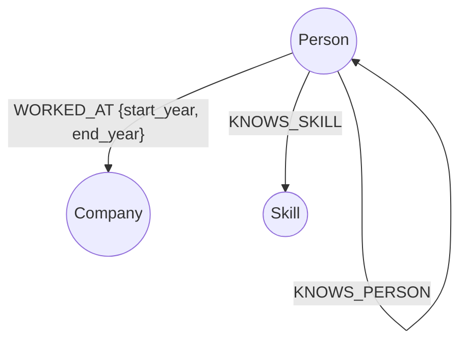

# Six Degrees of Tech

This application visualizes a professional tech network and explores connections between Tech Workers, Companies, and Skills. It is built as a Graph Database Application backed by CognoDB for the Wexa AI take-home assignment.

## Why a Graph Database?
Relational databases (SQL) are highly optimized for aggregating rows (e.g., "Count all employees at Company X"). However, they struggle when queries involve **deep relationships** and **pathfinding**.

In our "Six Degrees of Tech" use case, the interesting questions are purely relational:
1. **Multi-hop pathfinding:** "What is the shortest chain of introductions between Person A and Person B?" In SQL, this requires recursive CTEs which are slow and exponentially expensive at runtime. In Cypher, it's a native traversal: `MATCH p = shortestPath((start)-[*]-(end))`.
2. **Recommendation / Indirect matching:** "Find people connected to me by 2 degrees who know React." In SQL, this requires multiple expensive `JOIN` tables and a `GROUP BY` to aggregate mutual connections. In a graph, nodes naturally hold pointers to their neighbors, making this traversal O(1) per hop.

## Data Model
The graph consists of three Node labels and three Relationship types:



## Tech Stack
* **Database**: CognoDB (Managed Graph Database)
* **Backend API**: Python + FastAPI + Official Neo4j Driver
* **Frontend**: React (Vite) + Vanilla CSS (Glassmorphism & Dark Mode)

## Setup and Run Instructions

### 1. Database Setup
1. Create a free account at [console.cognodb.com](https://console.cognodb.com).
2. Provision a free instance.
3. Add a `.env` file to the `backend/` directory with your connection details:
```env
NEO4J_URI=bolt+s://<your-instance-id>.databases.cognodb.cloud
NEO4J_USERNAME=cognodb
NEO4J_PASSWORD=<your-password>
```

### 2. Backend & Seeding
1. Navigate to the `backend` directory.
2. Install dependencies: `pip install -r requirements.txt`
3. Run the seed script to populate the database with mock data: `python seed.py`
4. Start the FastAPI server: `python -m uvicorn main:app --reload`

### 3. Frontend
1. Navigate to the `frontend` directory.
2. Install dependencies: `npm install`
3. Start the dev server: `npm run dev`
4. Open the displayed `localhost` URL in your browser.

## The Cypher Queries Explained

### 1. Search Query
Finds nodes by a fuzzy text search across all labels.
```cypher
MATCH (n)
WHERE (n:Person OR n:Company OR n:Skill) 
  AND toLower(n.name) CONTAINS toLower($q)
RETURN elementId(n) AS id, labels(n)[0] AS type, n.name AS name, n.role AS role, n.industry AS industry
LIMIT 20
```

### 2. Multi-hop Traversal (Shortest Path)
Finds the shortest relational path between two nodes regardless of connection type.
```cypher
MATCH (start) WHERE elementId(start) = $start_id
MATCH (end) WHERE elementId(end) = $end_id
MATCH p = shortestPath((start)-[*]-(end))
RETURN nodes(p) AS nodes, relationships(p) AS edges
```

### 3. Relational-Awkward Recommendation Query
Finds people up to 2 degrees away (`[:KNOWS_PERSON*1..2]`) who have a specific skill (`[:KNOWS_SKILL]`), ordered by the amount of mutual connections.
```cypher
MATCH (me:Person) WHERE elementId(me) = $person_id
MATCH (me)-[:KNOWS_PERSON*1..2]-(target:Person)-[:KNOWS_SKILL]->(s:Skill)
WHERE toLower(s.name) CONTAINS toLower($skill) AND me <> target

// Optional match to count the exact number of mutual connections
OPTIONAL MATCH (me)-[:KNOWS_PERSON]-(mutual:Person)-[:KNOWS_PERSON]-(target)

RETURN elementId(target) AS id, target.name AS name, target.role AS role, 
       count(mutual) AS mutual_connections
ORDER BY mutual_connections DESC
LIMIT 10
```
